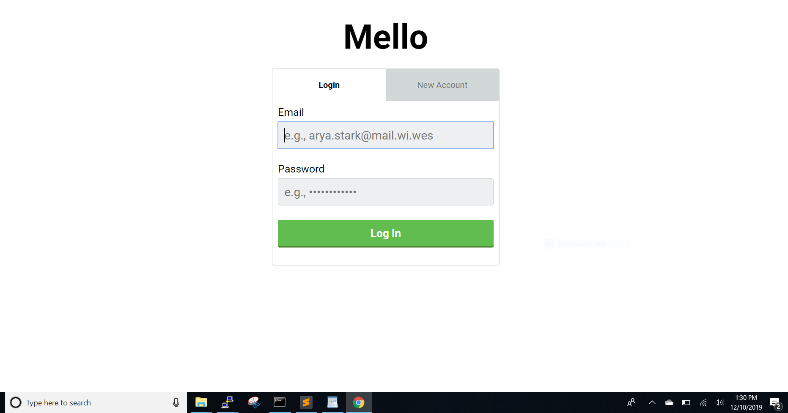
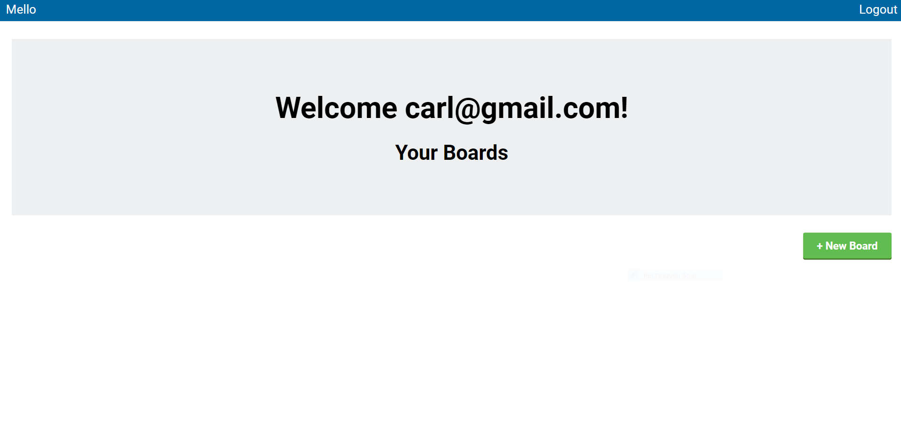
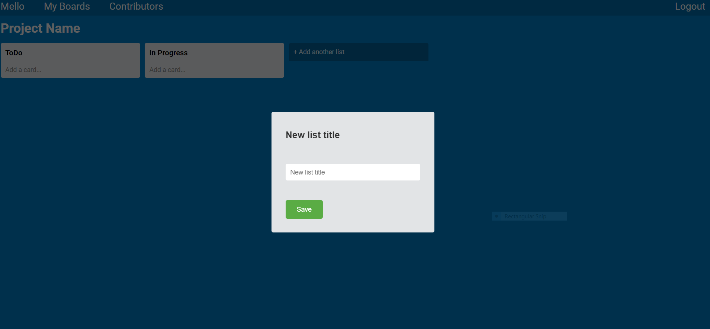
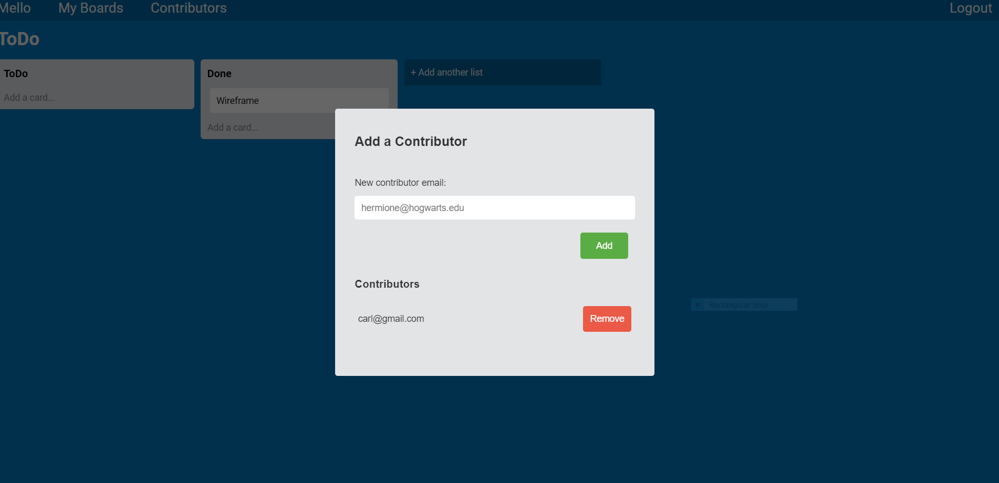

 
 
 
 A Full Stack version of a Trello clone. 
 
 How to use:
 
 1) https://mello-carl-hofstrom.herokuapp.com
 2) Click 'New Account' and enter a valid email and password
 3) Click 'Sign In' with same credentials
 
 4) Click '+ New Board' to create a board, enter board name ex. Name of project. Click 'Save'
 5) Click on your new board at the bottom left
 6) Click '+ Add another list' to add lists, ex. ToDo, In Progress, Done
 
 7) Click 'Add a card' to add specific tasks, Click 'Save'
 8) At this point you can drag and drop your lists and cards(tasks) accordingly 
 9) Click 'Contributors' in top navbar to add members of your team and who will have access 
 
 10) Click 'My Boards' in top nav bar to see your boards
 11) Click 'Log Out' in upper right
 
 
 
 
 Application features:
 
 JQuery, modals, authentication, and drag and drop functionality.

 
 
 Made with Javascript and Ruby on Rails by
 Carl Hofstrom hofstromcarl@gmail.com
 
 
 https://mello-carl-hofstrom.herokuapp.com/
 
 
 
 
